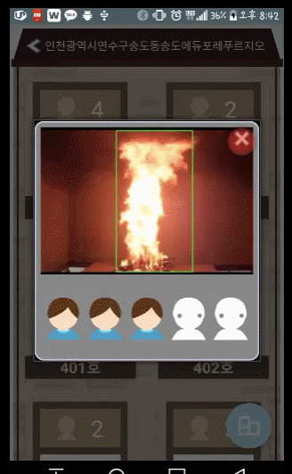

# Ohora-OLoRa - 

작품명 G.T.A 7 (Golden time available within 7 minutes) : 2016 대한민국 S/W 해카톤 출품작

-이글이글 팀(김현준, 최요한, 한지민,석기열, 김수진)

---
##영상처리와 일산화탄소를 통해 화재를 감지하고 감지한 화재 정보를 Firebase DB에 저장, 그후 어플리케이션과 웹페이지에서 열람하는 시스템입니다.
---
###화염감지 프로세스

1. 배경제거

2. 화염의 RGB값을 통해 화염 후보군 생성
3. 노이즈 제거
4. 후보군 트래킹 하며 피쳐들에 맞추어 화염 여부 체크 (features : 색상, 확장성, 불규칙적 움직임)

5. 2-4 반복
6. 화염 감지

---
###LoRa Network
-소용량 장거리 무선통신기술
- 1 to N 통신 

- ACK 활용하여 구현
- 화재지에서 감지한 화재정보를 관공서 서버로 전송할 때 활용
---
###소방관용 웹페이지와 안드로이드 어플리케이션

 - 서버에 업데이트 된 화재 정보(화재지 사진, 실시간 현재인원 정보)를 열람.
 - 소방관 앱 : 실시간 인원정보, 센서값 화재사진 열람
 - 유저 앱 : 실시간 인원정보 및 개인 노드 상태 열람.
---
사용한 기술 : 아두이노, Lora모듈, 캠, openCV 3.0이상, Google Firebase, Nodejs, Android
---
FiremanApp (소방관용 어플리케이션)
UserApp (유저 어플리케이션)
FlameDetection(영상처리를 통한 화재감지)
nodeJS(web)
client_cpp(GatewayToNode)

LoRa Receive는 waspmote 예제코드를 활용하였음
---
ppt자료 참고 바람
